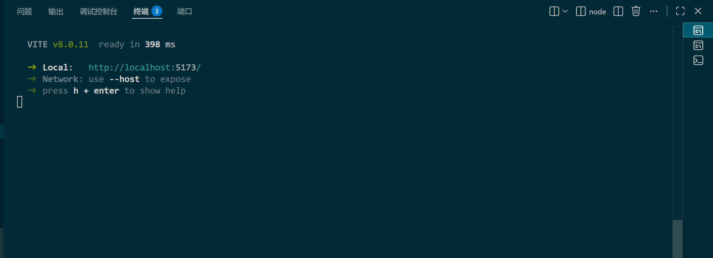
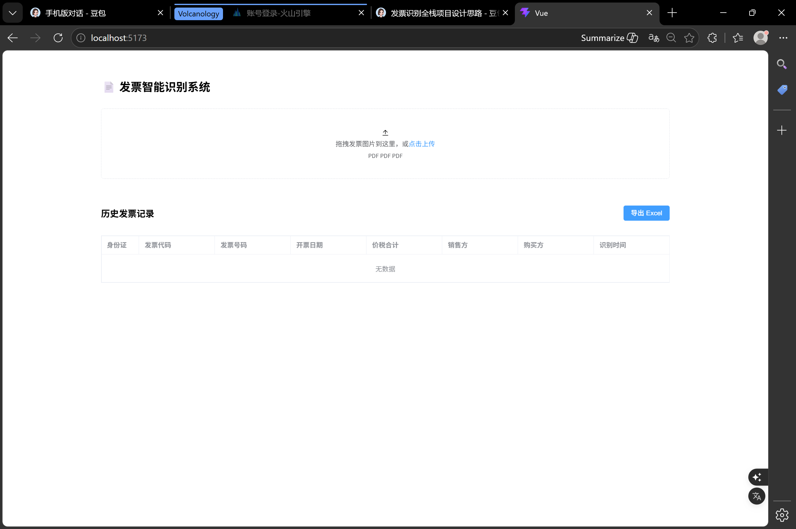
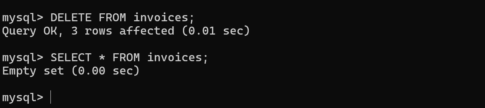
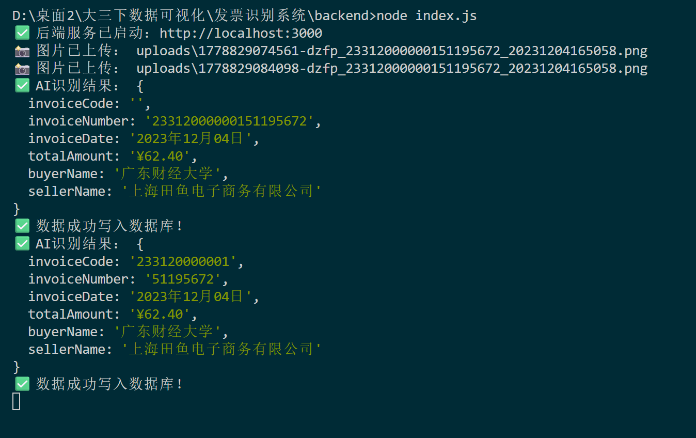
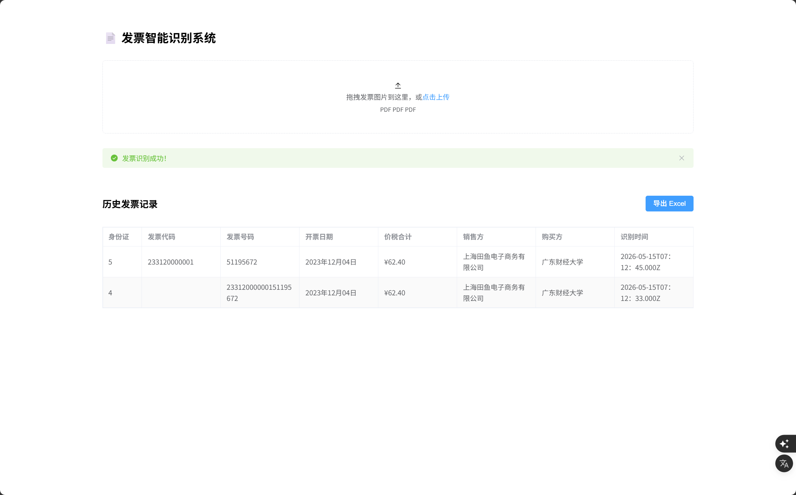
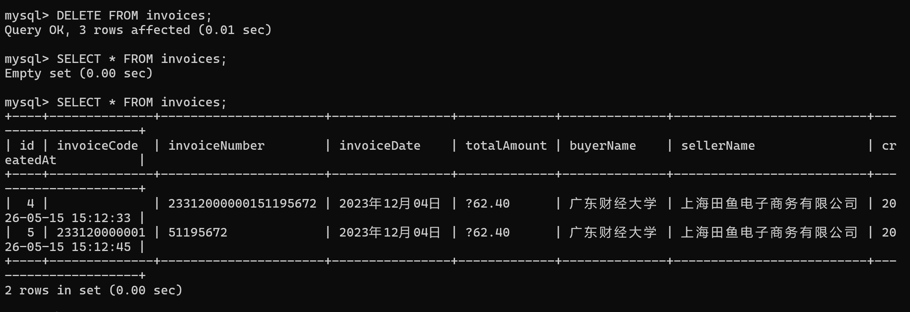

# **AI识别发票系统开发**
## **1.关键代码实现**
**1.前端代码（仅展示主要部分，采取vue3框架）**

    //✅ 修复：导出字段对应数据库真实字段
    function exportExcel() {
    const data = [
        ['ID', '发票代码', '发票号码', '开票日期', '价税合计', '销售方', '购买方', '识别时间'],
        ...invoiceList.value.map(item => [
        item.id,
        item.invoiceCode,
        item.invoiceNumber,
        item.invoiceDate,
        item.totalAmount,
        item.sellerName,
        item.buyerName,
        item.createdAt  
        ])
    ]

  **此处在开始时没有和数据库还有后端字段匹配导致前后端的连接出现问题，但在后续的改进中，我主动发现此点做出调整**

**2.后端代码（使用的是node.js,下次会尝试使用Djiango）**

services文件，也就是doubao.js在本次实验中是开始未成功的主要原因，也是因为数据库的字段的类型不统一所导致

    data: {
        model: doubao.model,
        messages: [
        {
            role: 'user',
            content: [
            {
                type: 'text',
                text: `你是发票识别专家，请从这张发票图片中提取以下信息，**只返回严格的JSON格式**，不要任何解释文字：
    {
    "invoiceCode": "发票代码",
    "invoiceNumber": "发票号码",
    "invoiceDate": "开票日期",
    "totalAmount": "价税合计金额",
    "buyerName": "购买方名称",
    "sellerName": "销售方名称"
    }`
                },
                {
                    type: 'image_url',
                    image_url: {
                    url: `data:image/jpeg;base64,${base64}`
                    }
    module.exports = router;

## **2.交互方式说明**
首先我是让豆包为我制定一个可行的前后端技术栈

//我想做一个全栈开发，包括前端、后端还有豆包API的调用，用途是识别发票信息，并整理成表格输出在前端并保存在本地的数据库，数据库密码是123456，告诉我设计思路，让我审核//

然后通过他给我代码，依次完成前端、后端、数据库的创建。其中遇到node.js无法安装，通过图片报错，他告诉我是权限越级所导致，而且我也无法通过powershell直接运行，会触发安全限制，而要使用cmd

//输入http://localhost:3000/api/invoices得到图片结果//

//问题原因
跨域限制：浏览器的同源策略会阻止前端（5173端口）直接请求后端（3000端口），但我们已经在后端代码里加了 app.use(cors())，理论上是允许跨域的。
你当前的操作不对：直接在浏览器地址栏输入 http://localhost:3000/api/invoices， 是浏览器自己发的请求，和跨域配置无关，所以会被拦截。//

注入以上此类

## **3.运行截图**
前端运行启动

后端运行启动

页面

数据库启动

执行业务（AI有点慢，稍等一下）

## **4.实验总结**
通过本次实验，首次感受了简单的AI项目开发，希望能达到老师的要求，也希望以后自己能有更好的进步